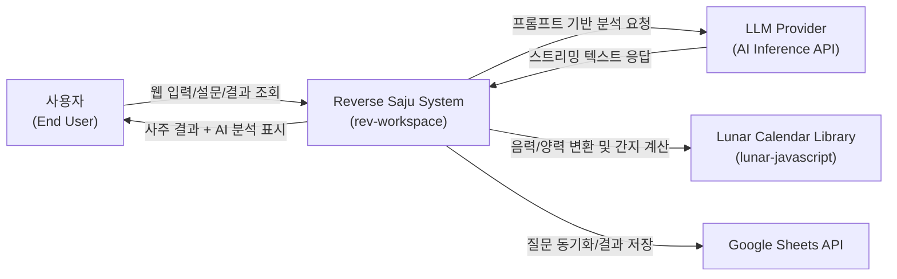
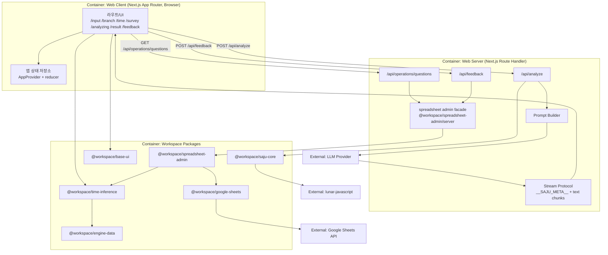
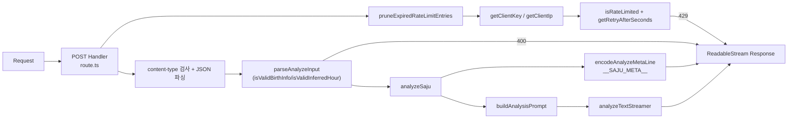
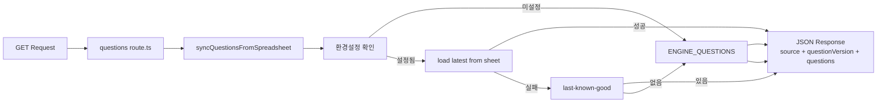
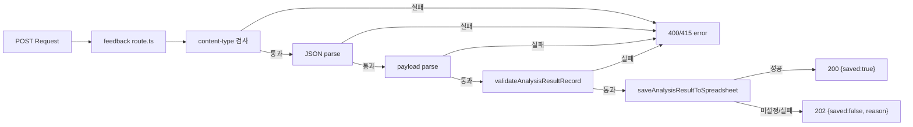
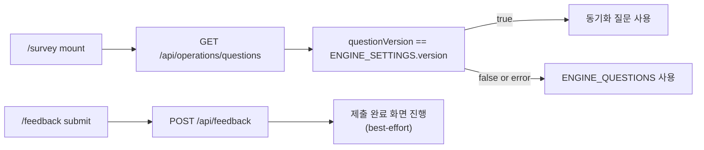

# 시스템 아키텍처 문서

이 문서는 `rev-workspace`의 현재 코드 기준 아키텍처를 설명한다.
대상은 신규 기여자, 운영 담당자, 도메인 로직/운영 연동 변경 작업자다.

빠르게 읽으려면 아래 문서부터 본다.

- `docs/package-architecture-summary.md`: 현재 패키지 구조와 책임 요약
- `docs/operations/integration/google-sheets-package-architecture.md`: Sheets 연동 상세 설계
- `docs/operations/observability/README.md`: GA/Sentry 운영 문서 인덱스

## 0. 빠른 읽기

현재 워크스페이스의 핵심 구조는 아래처럼 보면 된다.

```text
apps/web
├─ UI/페이지/라우트/API
├─ @workspace/base-ui
├─ @workspace/saju-core
├─ @workspace/time-inference
├─ @workspace/spreadsheet-admin/server
├─ @workspace/ga
└─ @workspace/sentry

@workspace/time-inference
├─ @workspace/engine-data
└─ @workspace/saju-core

@workspace/spreadsheet-admin
├─ @workspace/google-sheets
└─ @workspace/time-inference
```

현재 구조에서 기억할 규칙은 네 가지다.

- `apps/web`은 workspace 패키지를 `exports` 기준으로만 소비한다.
- domain 패키지는 operations 패키지를 의존하지 않는다.
- Google Sheets 저수준 transport는 `@workspace/google-sheets`, 앱용 유스케이스는 `@workspace/spreadsheet-admin`이 맡는다.
- observability 공통 helper는 별도 코어 패키지 없이 `@workspace/ga`, `@workspace/sentry` 내부에 둔다.

## 1. 시스템 개요

본 프로젝트는 사주 분석 웹 애플리케이션이며, 핵심 기능은 아래 세 축으로 구성된다.

- 사주 원국 계산 (`@workspace/saju-core`)
- 설문 기반 생시(시주) 역추론 (`@workspace/time-inference`)
- 운영 스프레드시트 기반 질문/결과 연동 (`@workspace/google-sheets`, `@workspace/spreadsheet-admin`)

애플리케이션은 Next.js App Router 기반이며, 도메인/운영 연동 로직은 워크스페이스 패키지로 분리되어 있다.

운영 연동 실무 절차(설정/검증/장애 대응)는 아래 사용 가이드를 함께 참고한다.

- `docs/operations/integration/google-sheets-usage-guide.md`

## 2. 모노레포 구조

```text
rev-workspace/
├─ apps/
│  └─ web                               # Next.js 제품 앱 (UI/API/라우트)
├─ packages/
│  ├─ domain/
│  │  ├─ saju-core                      # 사주 계산/검증 도메인
│  │  ├─ time-inference                 # 설문 추론 엔진 도메인
│  │  └─ engine-data                    # 엔진 JSON 데이터(SoT)
│  ├─ design-systems/
│  │  └─ base-ui                        # 공유 UI 컴포넌트
│  └─ operations/
│     ├─ google-sheets                  # Google Sheets transport/auth 인프라
│     └─ spreadsheet-admin              # 시트 스키마 정규화/동기화/결과 저장 유스케이스
└─ docs/                                # 운영/마이그레이션/설계 문서
```

워크스페이스 설정은 `pnpm-workspace.yaml`에서 `apps/*`, `packages/*`, `packages/*/*`를 포함한다.

## 3. 계층 및 의존성

의존성 원칙은 다음과 같다.

- 앱 레이어(`apps/web`)는 워크스페이스 패키지(`@workspace/*`)를 소비한다.
- 도메인 패키지는 명시된 방향으로만 상호 의존한다.
- `@workspace/time-inference`는 `@workspace/engine-data`, `@workspace/saju-core`를 의존한다.
- `@workspace/base-ui`는 앱 UI 공통 계층으로 사용된다.
- operations 패키지는 domain/integration 패키지를 의존할 수 있으나, domain 패키지는 operations 패키지를 의존하지 않는다.

### 의존성 그래프

```text
@workspace/engine-data ───▶ @workspace/time-inference ───┐
                                                          │
@workspace/saju-core ─────────────────────────────────────┼──▶ apps/web
                                                          │
@workspace/base-ui ───────────────────────────────────────┤
                                                          │
@workspace/google-sheets ─▶ @workspace/spreadsheet-admin ─┘
                               │
                               └──────────────▶ @workspace/time-inference

제약: @workspace/domain/* 는 @workspace/operations/* 를 의존하지 않는다.
```

## 4. 런타임 아키텍처

### 4.1 프론트엔드 상태 관리

`apps/web/lib/store.tsx`의 `AppProvider` + reducer로 단일 앱 상태를 관리한다.

주요 상태:

- `birthInfo`: 출생 정보
- `birthTimeKnowledge`: 생시 인지 상태(`known | unknown | approximate`)
- `surveyAnswers`: 설문 답변
- `inferredHour`: 추론된 시주
- `sajuResult`: 계산된 사주 결과
- `analysisResult` / `analysisText`: AI 분석 결과 및 스트림 텍스트

### 4.2 사용자 플로우

```text
/                시작
└─ /input        출생 정보 입력
   └─ /branch    생시 인지 여부 분기
      ├─ known        -> /time -> /analyzing -> /result -> /feedback
      ├─ unknown      -> /survey -> /analyzing -> /result -> /feedback
      └─ approximate  -> /time?mode=approximate -> /survey -> /analyzing -> /result -> /feedback
```

추가 런타임 포인트:

- `/survey` 진입 시 `GET /api/operations/questions`를 호출해 질문 세트 동기화를 시도한다.
- 질문 버전이 현재 엔진 버전(`ENGINE_SETTINGS.version`)과 다르면 기본 질문(`ENGINE_QUESTIONS`)을 유지한다.
- `/feedback` 제출 시 `POST /api/feedback`로 결과 저장을 시도하되, 실패해도 사용자 완료 플로우는 유지한다(best-effort).

### 4.3 분석 API 흐름 (`/api/analyze`)

`apps/web/app/api/analyze/route.ts`는 다음 순서로 동작한다.

1. rate-limit 저장소 정리 및 요청 제한 검사
2. `content-type` / JSON 파싱 검증
3. `parseAnalyzeInput`으로 `birthInfo`, `inferredHour` 구조 검증
4. `analyzeSaju`로 authoritative 사주 결과 계산
5. 프롬프트 생성(`buildAnalysisPrompt`)
6. AI 스트림 시작 + 메타 라인(`__SAJU_META__{...}`) 선행 전송
7. 텍스트 청크 스트리밍 응답

클라이언트(`app/analyzing/page.tsx`)는 메타 라인에서 `sajuResult`를 우선 복원하고,
본문은 섹션 파서(`parseAnalysisSections`)로 결과 페이지 표시용 구조로 변환한다.

### 4.4 질문 동기화 API 흐름 (`/api/operations/questions`)

`apps/web/app/api/operations/questions/route.ts`는 아래 정책으로 동작한다.

1. 테스트 주입 resolver가 있으면 우선 사용
2. 기본 경로는 `syncQuestionsFromSpreadsheet()` 호출
3. 스프레드시트/서비스 계정 미설정 시 `engine-default`로 즉시 응답
4. 설정된 경우 `spreadsheet-admin` 경로로 최신 동기화 시도
5. 최신 로드 실패 시 내부 fallback(last-known-good) 또는 최종적으로 `engine-default` 응답

응답 source:

- `spreadsheet-latest`
- `spreadsheet-fallback`
- `engine-default`

### 4.5 피드백 저장 API 흐름 (`/api/feedback`)

`apps/web/app/api/feedback/route.ts`는 아래 순서로 동작한다.

1. `content-type` 검사 (`application/json`)
2. JSON 파싱
3. payload 구조 파싱 (`AnalysisResultRecord` 호환)
4. `validateAnalysisResultRecord` 검증
5. `saveAnalysisResultToSpreadsheet` 실행
6. 저장 성공 시 `200 { saved: true }`, 미설정/실패 시 `202 { saved: false, reason }`

### 4.6 스프레드시트 연동 환경 변수

- `GOOGLE_SPREADSHEET_ADMIN_ID`
- `GOOGLE_SPREADSHEET_QUESTIONS_RANGE` (선택, 기본 `Questions!A:K`)
- `GOOGLE_SPREADSHEET_RESULTS_RANGE` (선택, 기본 `Results!A:J`)
- `GOOGLE_SERVICE_ACCOUNT_EMAIL`
- `GOOGLE_SERVICE_ACCOUNT_PRIVATE_KEY`
- `GOOGLE_SERVICE_ACCOUNT_PRIVATE_KEY_ID` (선택)
- `GOOGLE_SERVICE_ACCOUNT_TOKEN_URI` (선택)
- `GOOGLE_SERVICE_ACCOUNT_SCOPES` (선택)
- `GOOGLE_SERVICE_ACCOUNT_SUBJECT` (선택)

환경 변수 템플릿 위치:

- `apps/web/.env.example`
- `packages/operations/google-sheets/.env.example`

Git 정책:

- `**/.env.example`만 추적하고, 그 외 `.env*`/`.envrc`는 ignore 처리한다.

## 5. 패키지 아키텍처

### 5.1 `@workspace/saju-core`

책임:

- 사주 기본 타입/상수 제공
- 사주팔자 계산(`calculateFourPillars`)
- 오행 분포 계산(`calculateFiveElements`)
- 종합 결과 산출(`analyzeSaju`)
- 입력 유효성 검증(`isValidBirthInfo`, `isValidInferredHour`, `parseAnalyzeInput`)

설계 포인트:

- 음력 입력 시 `lunar-javascript`로 양력 변환 후 계산
- 시간 미입력 시 기본 분기 처리(시주 대체 경로)
- API와 클라이언트가 같은 검증 함수를 재사용

### 5.2 `@workspace/time-inference`

책임:

- 엔진 데이터 로드(`engine/loader.ts`)
- 설문 점수 계산, softmax 확률화, cusp 판단
- 모니터링 지표 계산(zishi diff, role influence, top1 band)
- 추론 결과를 앱 계약 형태(`InferredHourPillar`)로 매핑

핵심 함수:

- `inferZishi(answers, { approximateRange })`
- `toInferredHourPillar(result, method)`

### 5.3 `@workspace/engine-data`

책임:

- 엔진 데이터 소스(JSON) 패키징
- 런타임 import 가능한 형태로 export
- SoT 체크섬 검사(`scripts/check-engine-sot.mjs`)를 빌드 파이프라인에 강제

### 5.4 `@workspace/google-sheets`

책임:

- Google Sheets API 호출 인프라(transport/resource)
- 서비스 계정/OAuth 토큰 공급자
- retry/backoff 및 HTTP 에러 모델
- 서버 전용 가드(`server-only`, `browser` export)

핵심 공개 API:

- `createSheetsClient`
- `values.get/batchGet/batchUpdate/append`
- `spreadsheets.batchUpdate`

### 5.5 `@workspace/spreadsheet-admin`

책임:

- 운영 질문 시트 row 스키마 검증/정규화
- `EngineQuestion[]` 변환
- latest 실패 시 `last-known-good` fallback
- 분석 결과 row 직렬화/append

핵심 공개 API:

- `loadQuestionSetFromSheet`
- `normalizeAdminSheetRows`
- `syncQuestionSetWithFallback`
- `appendAnalysisResult`

## 6. 데이터/프로토콜 계약

### 6.1 `/api/analyze` 스트림 계약

`Content-Type: text/plain; charset=utf-8` 스트림이며, 첫 줄은 메타 프로토콜 라인이다.

```text
__SAJU_META__{"sajuResult":...}\n
<AI 본문 텍스트 스트림>
```

메타 라인 파싱 실패 시 클라이언트는 본문만 표시할 수 있으나,
현재 구현은 authoritative 결과 유무를 기준으로 결과 화면 이동을 제어한다.

### 6.2 `/api/operations/questions` 응답 계약

```json
{
  "source": "spreadsheet-latest | spreadsheet-fallback | engine-default",
  "questionVersion": "4.1",
  "questions": [
    {
      "id": "Q1",
      "structure_role": "noise_reduction",
      "category": "...",
      "question_weight": 1,
      "text": "...",
      "options": [{ "text": "...", "score_map": { "자시": 1 } }]
    }
  ],
  "warning": "question-sync-failed"
}
```

### 6.3 `/api/feedback` 요청/응답 계약

요청은 `AnalysisResultRecord`를 기반으로 하며 `sessionId`, `timestamp`, `engineVersion`,
`questionVersion`, `birthTimeKnowledge`, `surveyAnswers`, `inferenceResult`, `monitoring`를 포함한다.

응답:

- `200 { "saved": true }`
- `202 { "saved": false, "reason": "not-configured | save-failed" }`
- `400/415` 유효성/콘텐츠 타입 오류

## 7. 빌드/검증 아키텍처

루트 스크립트:

- `pnpm dev`: 의존 패키지 빌드 후 web dev
- `pnpm build`: Turbo 기반 의존성 인지 빌드
- `pnpm lint`
- `pnpm typecheck`
- `pnpm test:engine`
- `pnpm ci:monorepo`: SoT 체크 + lint/typecheck/test:engine/build

Turbo 파이프라인(`turbo.json`) 포인트:

- `build`는 `^build` 의존
- `typecheck`는 `build`, `^build` 의존
- `test:engine`는 `build` 의존

즉, 앱 빌드 전에 domain/operations 패키지 빌드 결과가 선행된다.

## 8. 운영/확장 가이드

새 기능 추가 시 아래 원칙을 따른다.

- UI 변경: `apps/web` + 필요 시 `@workspace/base-ui` 확장
- 사주 계산 변경: `@workspace/saju-core`에 우선 반영
- 추론 엔진 변경: `@workspace/time-inference` + `@workspace/engine-data` 동기화
- 운영 시트 연동 변경: `@workspace/google-sheets` / `@workspace/spreadsheet-admin` 우선 반영
- 엔진 데이터 변경 시 SoT 체크(`check-engine-sot`) 통과 필수
- API 계약 변경 시 관련 route 테스트와 클라이언트 파서 동시 업데이트

## 9. 현재 알려진 리스크

- AI 본문 섹션화가 헤딩 포맷 품질에 의존한다.
- rate-limit key가 IP 기반이라 프록시/NAT 환경에서 과차단 가능성이 있다.
- 질문 동기화는 안전 fallback(`engine-default`)이 있어도 운영 설정 오류가 즉시 드러나지 않을 수 있다.
- 피드백 저장은 best-effort(202 허용)라서 별도 재시도/관측 체계가 없으면 일부 누락 가능성이 있다.
- `web` 테스트 스크립트가 `pnpm dlx tsx`를 사용해 네트워크 제약 환경에서 불안정할 수 있다.

## 10. C4 스타일 다이어그램

### 10.1 System Context (Level 1)



### 10.2 Container (Level 2)



### 10.3 Component (Level 3: `/api/analyze`)



### 10.4 Component (Level 3: `/api/operations/questions`)



### 10.5 Component (Level 3: `/api/feedback`)



### 10.6 Component (Level 3: `/survey` + `/feedback` 클라이언트 연계)



---
최종 갱신: 2026-03-03 (코드베이스 기준)
