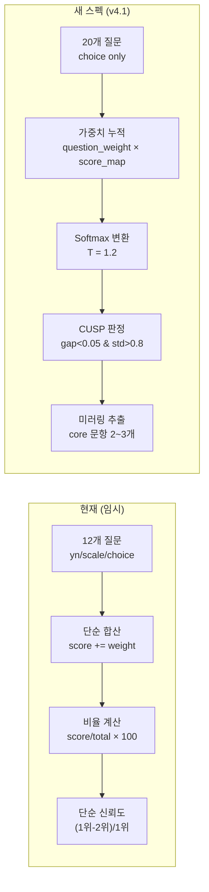

# 역추론 엔진 리팩토링 상세 계획 - Claude Opus

> **기준 문서**: `docs/data/engine.json` (v4.1) + `docs/archived/prd/engine-data-description.md`

---

## 1. 현재 코드 vs 실제 스펙 — 핵심 차이 요약

| 항목            | 현재 코드 (임시)                | 실제 스펙 (engine.json v4.1)                               |
| --------------- | ------------------------------- | ---------------------------------------------------------- |
| **질문 수**     | 12개                            | **20개**                                                   |
| **질문 타입**   | `yn` / `scale` / `choice` (3종) | **`choice` 단일 타입** (모든 질문이 선택지 방식)           |
| **질문 역할**   | 없음                            | `noise_reduction` / `core` / `fine_tune` / `closing` (4종) |
| **가중치 체계** | 답변에 직접 정수 가중치         | `question_weight`(0.8~1.5) × `score_map` 점수              |
| **점수 범위**   | 양수만 (1~3)                    | **양수 + 음수** (-6 ~ +4)                                  |
| **확률 변환**   | 없음 (단순 합산 → 비율)         | **Softmax** (Temperature=1.2)                              |
| **신뢰도**      | `(1위 - 2위) / 1위 × 100`       | **CUSP 판정**: gap < 0.05 AND std > 0.8 → 하이브리드       |
| **시진 키**     | 한자 (`'子'`, `'丑'`, ...)      | **한글** (`'자시'`, `'축시'`, ...)                         |
| **Guardrails**  | 없음                            | Core 영향력 65% 상한 모니터링                              |
| **AI 프롬프트** | 일반 명리학 분석                | **Therapeutic Saju** 미러링 + 확률 기반 표현               |

---

## 2. 수정 대상 파일 및 변경 상세

### 2.1. 타입 정의

#### [MODIFY] [types.ts](file:///Users/sangyeon/Desktop/projects/rev/lib/survey/types.ts)

현재 `QuestionType = 'yn' | 'scale' | 'choice' | 'select'` 체계를 engine.json의 단일 choice 체계로 단순화하고, `structure_role`, `question_weight`, `score_map` 개념을 반영합니다.

```diff
-export type QuestionType = 'yn' | 'scale' | 'choice' | 'select'
+// 질문의 구조적 역할
+export type StructureRole = 'noise_reduction' | 'core' | 'fine_tune' | 'closing'

-export interface WeightMap {
-  [key: string]: Partial<Record<EarthlyBranch, number>>
-}
+// 시진 이름 (한글)
+export type ZishiName = '자시' | '축시' | '인시' | '묘시' | '진시' | '사시'
+  | '오시' | '미시' | '신시' | '유시' | '술시' | '해시'

-export interface QuestionOption {
-  label: string
-  value: string
-  weights: Partial<Record<EarthlyBranch, number>>
-}
+// 답변 선택지의 시진별 점수 맵
+export type ScoreMap = Partial<Record<ZishiName, number>>

-export interface SurveyQuestion {
-  id: string
-  type: QuestionType
-  text: string
-  subText?: string
-  category: string
-  weights?: { yes: ..., no: ... }
-  options?: QuestionOption[]
-  scaleWeights?: { low: ..., mid: ..., high: ... }
-  scaleLabels?: { low: string; high: string }
-}
+export interface QuestionOption {
+  text: string
+  score_map: ScoreMap
+}
+
+export interface SurveyQuestion {
+  id: string
+  structure_role: StructureRole
+  category: string
+  question_weight: number
+  text: string
+  options: QuestionOption[]
+}

 export interface SurveyAnswer {
   questionId: string
-  value: string | number
+  value: number  // 선택한 option의 인덱스
 }

+// CUSP 판정 결과
+export interface CuspResult {
+  isCusp: boolean        // gap < 0.05 AND std > 0.8
+  gap: number            // Top1 - Top2 확률 차이
+  stdDev: number         // 12시진 확률의 표준편차
+}

 export interface SurveyResult {
   answers: SurveyAnswer[]
-  inferredBranch: EarthlyBranch
-  inferredBranchKr: string
+  inferredZishi: ZishiName
   confidence: number
+  probabilities: Record<ZishiName, number>  // Softmax 확률 분포
+  cusp: CuspResult
   topCandidates: Array<{
-    branch: EarthlyBranch
-    branchKr: string
+    zishi: ZishiName
     score: number
     percentage: number
   }>
+  // 미러링용: 점수 변동폭이 가장 큰 core 문항 2~3개
+  mirroringQuestions: Array<{
+    questionId: string
+    questionText: string
+    selectedOptionText: string
+    impactScore: number
+  }>
 }
```

---

### 2.2. 질문 데이터

#### [DELETE] [questions.ts](file:///Users/sangyeon/Desktop/projects/rev/lib/survey/questions.ts)

현재의 12개 임시 질문을 완전히 제거하고, `engine.json`에서 런타임에 로드하는 방식으로 전환합니다.

#### [NEW] `lib/survey/engine-data.ts`

`engine.json`의 데이터를 타입 안전하게 import하고, 엔진 설정값(Temperature, CUSP 파라미터 등)을 export합니다.

```typescript
import engineJson from '@/docs/data/engine.json';
import type { SurveyQuestion, ZishiName } from './types';

// 엔진 설정
export const ENGINE_SETTINGS = {
  version: engineJson.engine_settings.version,
  temperature: engineJson.engine_settings.default_temperature, // 1.2
  cusp: {
    gapThreshold: engineJson.engine_settings.cusp_logic.gap_threshold, // 0.05
    minScoreStd: engineJson.engine_settings.cusp_logic.min_score_std, // 0.8
  },
  monitoring: {
    maxRoleInfluence: engineJson.engine_settings.score_monitoring.alert_if_role_influence_over, // 0.65
    maxZishiDiff: engineJson.engine_settings.score_monitoring.alert_if_zishi_max_diff_over, // 8
  },
} as const;

// 시진 목록
export const ZISHI_LIST: ZishiName[] = engineJson.engine_settings.zishi_list as ZishiName[];

// 질문 데이터 (engine.json에서 직접 import)
export const QUESTIONS: SurveyQuestion[] = engineJson.questions as SurveyQuestion[];

// 역할별 가중치 승수 (description 문서 기준)
export const ROLE_WEIGHT_MULTIPLIER: Record<string, number> = {
  noise_reduction: 0.8,
  core: 1.5,
  fine_tune: 1.2,
  closing: 1.0,
};
```

---

### 2.3. 추론 엔진 (핵심 변경)

#### [MODIFY] [weight-engine.ts](file:///Users/sangyeon/Desktop/projects/rev/lib/survey/weight-engine.ts)

**현재 알고리즘** (단순 합산):

```
score[지지] = Σ(option.weights[지지])
percentage = score / total × 100
confidence = (1위 - 2위) / 1위 × 100
```

**새 알고리즘** (3단계 파이프라인):

```
① score[시진] = Σ(question_weight × option.score_map[시진])
② prob[시진] = softmax(score / Temperature)  (T=1.2)
③ CUSP 판정: gap < 0.05 AND std > 0.8 → 하이브리드
```

구현할 함수 목록:

| 함수                              | 설명                                                         |
| --------------------------------- | ------------------------------------------------------------ |
| `calculateRawScores(answers)`     | 각 답변의 `question_weight × score_map` 점수를 12시진에 누적 |
| `softmax(scores, temperature)`    | Softmax 확률 변환 (T=1.2)                                    |
| `evaluateCusp(probabilities)`     | CUSP 판정 (gap < 0.05, std > 0.8)                            |
| `findMirroringQuestions(answers)` | 점수 변동폭이 가장 큰 core 문항 2~3개 추출                   |
| `inferHourBranch(answers)`        | 위 함수들을 조합하여 최종 `SurveyResult` 반환                |

```typescript
// softmax 구현
function softmax(scores: Record<ZishiName, number>, T: number): Record<ZishiName, number> {
  const entries = Object.entries(scores) as [ZishiName, number][];
  const maxScore = Math.max(...entries.map(([_, s]) => s));
  const exps = entries.map(([z, s]) => [z, Math.exp((s - maxScore) / T)] as const);
  const sumExp = exps.reduce((sum, [_, e]) => sum + e, 0);
  const result = {} as Record<ZishiName, number>;
  for (const [z, e] of exps) {
    result[z] = e / sumExp;
  }
  return result;
}

// CUSP 판정
function evaluateCusp(probs: Record<ZishiName, number>): CuspResult {
  const sorted = Object.values(probs).sort((a, b) => b - a);
  const gap = sorted[0] - sorted[1];
  const mean = sorted.reduce((s, v) => s + v, 0) / sorted.length;
  const stdDev = Math.sqrt(sorted.reduce((s, v) => s + (v - mean) ** 2, 0) / sorted.length);
  return { isCusp: gap < 0.05 && stdDev > 0.8, gap, stdDev };
}
```

---

### 2.4. 시진 ↔ 지지 매핑

#### [NEW] `lib/survey/zishi-mapping.ts`

engine.json은 한글 시진명(`'자시'`, `'축시'`...)을 사용하고, 기존 사주 계산 코드는 한자 지지(`'子'`, `'丑'`...)를 사용합니다. 이 변환 레이어가 필요합니다.

```typescript
import type { EarthlyBranch } from '../saju/types';
import type { ZishiName } from './types';

export const ZISHI_TO_BRANCH: Record<ZishiName, EarthlyBranch> = {
  자시: '子',
  축시: '丑',
  인시: '寅',
  묘시: '卯',
  진시: '辰',
  사시: '巳',
  오시: '午',
  미시: '未',
  신시: '申',
  유시: '酉',
  술시: '戌',
  해시: '亥',
};

export const BRANCH_TO_ZISHI: Record<EarthlyBranch, ZishiName> = {
  子: '자시',
  丑: '축시',
  寅: '인시',
  卯: '묘시',
  辰: '진시',
  巳: '사시',
  午: '오시',
  未: '미시',
  申: '신시',
  酉: '유시',
  戌: '술시',
  亥: '해시',
};
```

---

### 2.5. 설문 UI 컴포넌트

#### [MODIFY] [survey/page.tsx](file:///Users/sangyeon/Desktop/projects/rev/app/survey/page.tsx)

**변경 사항:**

- 질문 수: 12 → **20**으로 증가 (프로그레스바 자동 반영)
- 질문 타입 분기 제거: `yn` / `scale` / `choice` 분기 → **단일 `choice` 렌더링**
- `QuestionYN`, `QuestionScale` 컴포넌트 import 제거
- `QuestionChoice`만 사용하되, `options` 형태가 `{ text, score_map }` 으로 변경되므로 props 조정
- 답변 저장: `value` 대신 선택한 **option 인덱스**를 저장

#### [MODIFY] [question-choice.tsx](file:///Users/sangyeon/Desktop/projects/rev/components/survey/question-choice.tsx)

- props에서 `options`의 타입을 `{ text: string; score_map: ScoreMap }[]` 으로 변경
- `label`/`value` 참조를 `text`로 변경
- `onAnswer`에 인덱스(number) 전달

#### [삭제 후보] `question-yn.tsx`, `question-scale.tsx`

- 새 스펙에서는 yn/scale 타입이 없으므로 사용하지 않음
- 단, 당장 삭제하지 않고 unused로 남겨둘 수도 있음 (선택사항)

---

### 2.6. InferredHourPillar 타입 연결

#### [MODIFY] [saju/types.ts](file:///Users/sangyeon/Desktop/projects/rev/lib/saju/types.ts)

`InferredHourPillar`에 CUSP 정보와 미러링 데이터 필드를 추가합니다.

```diff
 export interface InferredHourPillar {
   branch: EarthlyBranch
   branchKr: string
   confidence: number
   topCandidates: Array<{
     branch: EarthlyBranch
     branchKr: string
     score: number
     percentage: number
   }>
   method: 'known' | 'survey' | 'approximate'
+  isCusp?: boolean
+  cuspSecondBranch?: EarthlyBranch
+  mirroringData?: Array<{
+    questionText: string
+    selectedOptionText: string
+  }>
 }
```

---

### 2.7. AI 프롬프트 (Therapeutic Saju)

#### [MODIFY] [prompts.ts](file:///Users/sangyeon/Desktop/projects/rev/lib/ai/prompts.ts)

스펙 문서의 설계 원칙을 반영합니다:

1. **미러링 로직**: core 문항 2~3개의 응답값을 프롬프트에 포함
2. **톤앤매너**: "따뜻한 상담가" 어조, 단정형 금지 (`~입니다` → `~할 확률이 높습니다`)
3. **확률 기반**: 신뢰도를 % 로 투명하게 제시
4. **CUSP 대응**: gap < 0.05일 때 두 시진 융합 조건부 프롬프트

```diff
-return `당신은 30년 경력의 전문 사주 명리학자입니다. 전통적 명리학 이론에 기반하되, 현대인이 이해하기 쉬운 언어로 설명합니다.
+return `당신은 30년 경력의 전문 사주 명리학자이며, 따뜻한 상담가(Therapist)입니다.
+전통적 명리학 이론에 기반하되, 분석적이되 차갑지 않은 어조로 설명합니다.
+
+## 핵심 원칙
+- 단정형 금지: "당신은 ~입니다" (X) → "~할 확률이 높습니다 / ~하는 경향을 보입니다" (O)
+- Therapeutic Saju: 유저가 설문에서 선택한 답변을 사주 명리학과 연결하여, "당신이 ~하게 행동했던 이유는 당신의 사주에 품어진 특별한 강점"이라고 미러링(Mirroring)하여 위로할 것.
+- 신뢰도를 항상 %로 투명하게 제시할 것.
+
+${mirroringSection}  // 설문에서 점수 변동폭이 가장 큰 core 문항 2~3개 인용
```

---

### 2.8. 상태관리 (store)

#### [MODIFY] [store.tsx](file:///Users/sangyeon/Desktop/projects/rev/lib/store.tsx)

- `SurveyAnswer` 타입 변경 (value: `string | number` → `number`)
- 새로운 `SurveyResult` 데이터(probabilities, cusp, mirroringQuestions)도 state에 저장할 수 있도록 Action 추가

---

### 2.9. API 라우트

#### [MODIFY] [route.ts](file:///Users/sangyeon/Desktop/projects/rev/app/api/analyze/route.ts)

- request body에서 `mirroringData`를 받아 프롬프트 빌더에 전달
- CUSP 상태를 프롬프트에 반영

---

## 3. 데이터 흐름 변경 요약



---

## 4. 수정 순서 (의존성 기반)

| 순서 | 파일                                    | 변경 내용                               | 의존 관계 |
| ---- | --------------------------------------- | --------------------------------------- | --------- |
| ①    | `lib/survey/types.ts`                   | 타입 전면 재정의                        | —         |
| ②    | `lib/survey/zishi-mapping.ts`           | 시진↔지지 변환 레이어 (신규)            | ①         |
| ③    | `lib/survey/engine-data.ts`             | engine.json import + 설정 export (신규) | ①         |
| ④    | `lib/survey/weight-engine.ts`           | Softmax + CUSP + 미러링 구현            | ①②③       |
| ⑤    | `lib/saju/types.ts`                     | InferredHourPillar CUSP 필드 추가       | —         |
| ⑥    | `app/survey/page.tsx`                   | 20문항 + choice only UI                 | ①③④       |
| ⑦    | `components/survey/question-choice.tsx` | props 타입 변경                         | ①         |
| ⑧    | `lib/ai/prompts.ts`                     | Therapeutic Saju + 미러링 프롬프트      | ⑤         |
| ⑨    | `lib/store.tsx`                         | SurveyAnswer, 새로운 Action 타입        | ①         |
| ⑩    | `app/api/analyze/route.ts`              | mirroringData 전달                      | ⑧⑨        |

---

## 5. 주의사항

> [!IMPORTANT]
> **Softmax Temperature (T=1.2)**는 환경변수 처리를 권장합니다. 하드코딩하되 나중에 환경변수로 교체 가능하도록 `ENGINE_SETTINGS` 상수로 분리합니다.

> [!WARNING]
> **음수 점수 (-6, -3 등)**: 현재 코드에는 양수만 존재하므로, 점수 합산 로직에서 음수를 정상 처리하는지 반드시 확인해야 합니다. Softmax는 음수를 자연스럽게 처리하지만, UI에서 percentage 표시 시 음수 raw score가 의미 없는 결과를 만들지 검증 필요합니다.

> [!CAUTION]
> **quiz engine.json의 `score_map` 키**가 한글 시진명(`'자시'`)을 사용하므로, 기존 한자 지지(`'子'`) 기반 코드와의 변환을 빠뜨리면 점수가 전혀 누적되지 않습니다. `zishi-mapping.ts` 변환 레이어를 반드시 거쳐야 합니다.

---

## 6. 검증 계획

### 6.1. 수동 검증 (개발자)

1. **Softmax 출력 검증**: 특정 답변 조합에 대해 12시진 확률의 합이 1.0(100%)인지 확인
2. **CUSP 판정 테스트**: Top1과 Top2 확률 차이가 5% 미만일 때 `isCusp: true` 반환 확인
3. **음수 점수 처리**: Q5 "바로 잠들어요" 선택 시 자시(-6) 점수가 정상 반영되는지 확인
4. **미러링 추출**: core 역할 문항 중 가장 큰 점수 변동폭을 가진 2~3개가 올바르게 추출되는지 확인

### 6.2. 브라우저 E2E 검증

1. `npm run dev`로 개발 서버 시작
2. `/input` → 생년월일 입력 → `/branch` → "모르겠어요" 선택 → `/survey` 진입
3. 20개 질문이 정상 렌더링되고 프로그레스바가 1/20 → 20/20까지 진행되는지 확인
4. 설문 완료 후 `/analyzing` → `/result` 정상 이동 확인
5. 결과 페이지에서 시주 추론 정보에 확률(%)이 표시되는지 확인

### 6.3. 사용자 수동 확인 요청

- AI 리포트의 톤앤매너가 "따뜻한 상담가" 어조로 변경되었는지 주관적 확인
- 미러링 문구("당신이 ~하게 행동했던 이유는...")가 리포트에 포함되는지 확인
